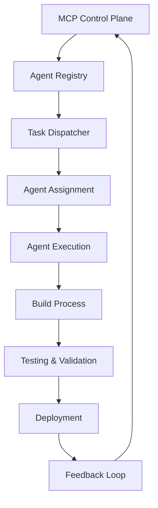
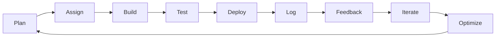

# 🚀 MCP Agent Manifest File — Trans Bot AI

> **Master Blueprint for Autonomous Agent Execution System**  
> **Complete Agent Protocols, Structure & Requirements**  
> **Production-Ready Autonomous Development Framework**

---

## 🎯 **Executive Summary**

This manifest defines the complete MCP (Model Context Protocol) Agent Execution System for Trans Bot AI, ensuring all autonomous agents operate with complete precision, autonomy, and production readiness. This system enables the rapid development and deployment of the world's first truly autonomous TMS ecosystem.

### **🏆 System Status**
- ✅ **Super Admin System**: Fully operational with MCP agents
- 🚀 **Portal Development**: 12 core modules in active development
- 🤖 **Agent Registry**: Complete agent management system
- 📊 **Control Plane**: Real-time monitoring and orchestration

---

## 📡 **Part 1: System Structure Diagram**

### **🧱 High-Level Architecture**

```
Trans Bot AI (Full Ecosystem)
│
├── SuperAdmin (✅ Complete)
│   ├── 80+ Pages
│   ├── RBAC & RLS
│   ├── Real-time Dashboard
│   └── MCP Agent Built
│
├── Portals (12 Core Modules)
│   ├── TMS Software
│   │   ├── Shipper Portal
│   │   ├── Broker Portal
│   │   └── Carrier Portal
│   ├── Accounting Portal
│   ├── CRM System
│   ├── Freight Rate Engine
│   ├── Load Board
│   ├── Onboarding Portal (eSign)
│   ├── Marketplace
│   ├── Factoring Portal
│   ├── Logistics Directory
│   └── Global EDI Software
│
└── MCP Control Plane
    ├── Agent Registry
    ├── Task Dispatcher
    ├── Agent Logs & Health
    ├── Confidence Scoring Engine
    └── Agent Feedback Loop
```

### **🔗 Agent Communication Flow**



---

## 🔐 **Part 2: MCP Agent Protocols & Structure**

### **🧠 Agent Protocol Definitions**

| Layer | Protocol | Description | Output |
|-------|----------|-------------|---------|
| **agent.init()** | Agent Registration | Registers agent with MCP Control Plane (type, goal, permission scope) | Agent ID, Registry Entry |
| **agent.assign()** | Task Assignment | Agent assigned to module, task, or sub-portal for autonomous completion | Assignment Token, Scope Definition |
| **agent.check()** | System Verification | Verifies design system, backend API access, routing paths, and DB schema | Validation Report, Dependency Map |
| **agent.build()** | Full Stack Development | Builds complete stack: frontend + backend + DB + RLS + test coverage | Production-Ready Code |
| **agent.test()** | Quality Assurance | Runs auto tests (unit + integration) & reports coverage + lint pass | Test Results, Coverage Report |
| **agent.deploy()** | Deployment | Deploys to staging branch for review or CI/CD auto pipeline | Deployment Status, URL |
| **agent.log()** | Progress Tracking | Logs output to MCP dashboard with completion percentage, errors, suggestions | Progress Log, Metrics |
| **agent.feedback()** | Iteration Loop | Agent accepts feedback (human or AI) and iterates until success | Iteration History, Final Output |

### **🧬 Agent Metadata Schema**

```json
{
  "agent_id": "tms.shipper.builder",
  "agent_type": "builder.frontend",
  "assigned_to": "Shipper Portal",
  "goal": "Build full Shipper Dashboard with load management, tracking, and billing",
  "status": "in_progress",
  "priority": "high",
  "estimated_duration": "48h",
  "modules": [
    "Dashboard",
    "Loads",
    "Tracking", 
    "Billing",
    "Documents"
  ],
  "dependencies": [
    "load-api",
    "tracking-db", 
    "permissions.shipper",
    "design-system",
    "supabase-client"
  ],
  "output": {
    "routes": [
      "src/routes/shipper/dashboard.tsx",
      "src/routes/shipper/loads.tsx",
      "src/routes/shipper/tracking.tsx"
    ],
    "components": [
      "ShipperDashboard.tsx",
      "LoadTable.tsx", 
      "TrackingMap.tsx",
      "BillingSummary.tsx"
    ],
    "db_tables": [
      "loads",
      "tracking", 
      "shipper_billing",
      "shipper_documents"
    ],
    "api_endpoints": [
      "/api/shipper/loads",
      "/api/shipper/tracking",
      "/api/shipper/billing"
    ]
  },
  "permissions": {
    "database_access": ["shipper_*"],
    "api_access": ["shipper_*"],
    "file_access": ["src/components/shipper/*"]
  },
  "quality_metrics": {
    "test_coverage_target": 85,
    "performance_target": "< 2.5s",
    "accessibility_target": "WCAG 2.1 AA"
  }
}
```

### **🎯 Agent Lifecycle Protocol**

```typescript
interface AgentLifecycle {
  // Phase 1: Planning & Assignment
  plan: {
    analyzeRequirements: (requirements: string) => Analysis;
    createBlueprint: (analysis: Analysis) => Blueprint;
    estimateResources: (blueprint: Blueprint) => ResourceEstimate;
  };
  
  // Phase 2: Development
  build: {
    setupEnvironment: (blueprint: Blueprint) => Environment;
    developFrontend: (blueprint: Blueprint) => FrontendCode;
    developBackend: (blueprint: Blueprint) => BackendCode;
    setupDatabase: (blueprint: Blueprint) => DatabaseSchema;
  };
  
  // Phase 3: Quality Assurance
  test: {
    runUnitTests: (code: Code) => TestResults;
    runIntegrationTests: (code: Code) => IntegrationResults;
    runPerformanceTests: (code: Code) => PerformanceResults;
    validateAccessibility: (code: Code) => AccessibilityResults;
  };
  
  // Phase 4: Deployment
  deploy: {
    buildProduction: (code: Code) => ProductionBuild;
    deployToStaging: (build: ProductionBuild) => StagingDeployment;
    runSmokeTests: (deployment: StagingDeployment) => SmokeTestResults;
    deployToProduction: (deployment: StagingDeployment) => ProductionDeployment;
  };
  
  // Phase 5: Monitoring & Feedback
  monitor: {
    trackPerformance: (deployment: ProductionDeployment) => PerformanceMetrics;
    collectFeedback: (deployment: ProductionDeployment) => UserFeedback;
    iterateImprovements: (feedback: UserFeedback) => Improvements;
  };
}
```

---

## ✅ **Part 3: MCP Agent Requirements**

### **📦 Structural Requirements (Every Agent Must Output)**

| Component | Requirement Details | Validation Criteria |
|-----------|-------------------|-------------------|
| **Frontend** | Fully responsive, dark/light mode, forms, tables, buttons, tabs, search | Mobile-first design, accessibility compliance |
| **Backend API** | Supabase RPC or REST endpoint + validation schema | OpenAPI spec, input validation, error handling |
| **Database Tables** | Supabase schema migration + RLS policies | Migration files, RLS policies, indexes |
| **RLS Policies** | Row-level access per role (e.g., carrier_id, broker_id filters) | Policy testing, access control validation |
| **Testing** | Unit tests (Vitest), integration tests for workflows | 85%+ coverage, all critical paths tested |
| **CI/CD Compatible** | Components exportable, deployable, and testable in isolation | Build passes, tests pass, deployment ready |
| **Live Routing** | Must be linked in route registry with slug, metadata, auth | Route registration, auth guards, metadata |
| **Documentation** | Auto-generated or AI-written README.md, docs.tsx, and /docs/api | Complete API docs, usage examples, setup guides |
| **Audit Logs** | Every data-changing agent writes to Supabase audit table | Audit trail, compliance logging, data lineage |

### **🚀 Agent Types & Specialization**

| Agent Type | Description | Primary Responsibilities | Output Examples |
|------------|-------------|-------------------------|-----------------|
| **builder.frontend** | UI/UX agent — builds forms, dashboards, modals, tables | React components, responsive design, accessibility | Dashboard.tsx, Form.tsx, Table.tsx |
| **builder.backend** | API/DB agent — builds RPCs, REST APIs, DB models | Supabase functions, API endpoints, database schema | api.ts, schema.sql, functions.sql |
| **builder.rls** | Security agent — configures RLS, permissions, access control | Row-level security, role-based access, audit policies | policies.sql, auth.ts, permissions.ts |
| **builder.tests** | Testing agent — generates unit/integration tests | Test coverage, integration tests, performance tests | test.spec.ts, integration.test.ts |
| **builder.docs** | Documentation agent — auto-writes guides, usage, API docs | API documentation, user guides, technical docs | README.md, API.md, docs.tsx |
| **reviewer.ux** | Design reviewer — checks for responsiveness, accessibility | Design validation, accessibility audit, UX review | Review report, accessibility score |
| **qa.autotest** | Runs testing suite, performance audit, regression scan | Automated testing, performance monitoring, quality gates | Test results, performance report |
| **deployer.env** | Auto-deploys to Vercel/Supabase staging w/ versioning | CI/CD pipeline, deployment automation, version control | Deployment status, build artifacts |

### **🧭 Agent Alignment Roadmap (TMS Phase 1)**

| Module | Assigned Agents | Goal | Timeline |
|--------|----------------|------|----------|
| **SuperAdmin ✅** | Complete | MCP agents already finalized | Completed |
| **TMS > Shipper** | builder.frontend.shipper, builder.backend.shipper, builder.rls.shipper | Full shipper portal with load management | Week 3-4 |
| **TMS > Broker** | builder.frontend.broker, builder.backend.broker, builder.rls.broker | Complete broker portal with carrier management | Week 5-6 |
| **TMS > Carrier** | builder.frontend.carrier, builder.backend.carrier, builder.rls.carrier | Carrier portal with driver tracking | Week 5-6 |
| **CRM** | builder.frontend.crm, builder.backend.crm, builder.tests.crm | Build Leads, Contacts, Notes, Pipeline | Week 3-4 |
| **Freight Rate Engine** | builder.frontend.rates, builder.backend.rates, builder.ai.rates | Build PADD rate logic with AI optimization | Week 7-8 |
| **Onboarding** | builder.frontend.onboarding, builder.rls.contracts, builder.docs.onboarding | Contract e-sign portal with compliance | Week 7-8 |

### **🧠 Autonomous Agent Lifecycle**



**Detailed Lifecycle Steps:**

1. **Plan** → Analyze requirements, create blueprint, estimate resources
2. **Assign** → Agent receives task, scope, and permissions
3. **Build** → Develop frontend, backend, database, and security
4. **Test** → Run comprehensive testing suite
5. **Deploy** → Deploy to staging and production
6. **Log** → Record progress, metrics, and outcomes
7. **Feedback** → Receive and process feedback
8. **Iterate** → Make improvements based on feedback
9. **Optimize** → Performance optimization and refinement

---

## 🎯 **Mission Success Checkpoints**

### **✅ Success Metrics**

| Success Factor | Target | Validation Method |
|----------------|--------|-------------------|
| **Functional Coverage** | 100% of UI/UX + Backend + DB | Automated testing, manual validation |
| **Error-Free Builds** | ✅ All green ✅ | CI/CD pipeline, build logs |
| **Test Coverage** | 85%+ | Coverage reports, test automation |
| **Compliance** | ✅ GDPR, SOC2 ready | Compliance audit, security review |
| **Deployment** | CI/CD auto deploy to staging | Deployment automation, health checks |
| **Documentation** | Agent-written, ready for QA | Documentation review, completeness check |

### **📊 Quality Gates**

```typescript
interface QualityGates {
  // Code Quality
  codeQuality: {
    linting: "ESLint + Prettier pass",
    typeChecking: "TypeScript strict mode",
    complexity: "Cyclomatic complexity < 10",
    duplication: "Code duplication < 5%"
  };
  
  // Testing
  testing: {
    unitTests: "85%+ coverage",
    integrationTests: "All critical paths",
    e2eTests: "User journey coverage",
    performanceTests: "< 2.5s response time"
  };
  
  // Security
  security: {
    rlsPolicies: "All tables protected",
    inputValidation: "All inputs validated",
    authentication: "Proper auth checks",
    auditLogging: "All changes logged"
  };
  
  // Accessibility
  accessibility: {
    wcagCompliance: "WCAG 2.1 AA",
    keyboardNavigation: "Full keyboard support",
    screenReader: "Screen reader compatible",
    colorContrast: "4.5:1 minimum ratio"
  };
}
```

---

## 🔧 **Agent Execution Commands**

### **🚀 Agent Initialization**

```bash
# Initialize new agent
mcp agent init --type builder.frontend --module shipper --goal "Build Shipper Dashboard"

# Assign agent to task
mcp agent assign --agent-id tms.shipper.builder --task "shipper-dashboard-v1"

# Check system requirements
mcp agent check --agent-id tms.shipper.builder --validate all
```

### **🏗️ Agent Development**

```bash
# Start development process
mcp agent build --agent-id tms.shipper.builder --phase frontend

# Run testing suite
mcp agent test --agent-id tms.shipper.builder --coverage 85

# Deploy to staging
mcp agent deploy --agent-id tms.shipper.builder --environment staging
```

### **📊 Agent Monitoring**

```bash
# Check agent status
mcp agent status --agent-id tms.shipper.builder

# View agent logs
mcp agent logs --agent-id tms.shipper.builder --tail 100

# Get performance metrics
mcp agent metrics --agent-id tms.shipper.builder --period 24h
```

---

## 🔄 **Agent Collaboration Protocol**

### **🤝 Multi-Agent Coordination**

```typescript
interface AgentCollaboration {
  // Agent Communication
  communication: {
    shareContext: (context: Context) => SharedContext;
    coordinateTasks: (tasks: Task[]) => TaskAssignment;
    resolveConflicts: (conflicts: Conflict[]) => Resolution;
  };
  
  // Resource Sharing
  resources: {
    shareComponents: (components: Component[]) => SharedComponents;
    shareAPIs: (apis: API[]) => SharedAPIs;
    shareSchemas: (schemas: Schema[]) => SharedSchemas;
  };
  
  // Quality Assurance
  quality: {
    peerReview: (code: Code) => ReviewResult;
    crossValidation: (validation: Validation) => CrossValidationResult;
    integrationTesting: (integration: Integration) => IntegrationResult;
  };
}
```

### **📋 Collaboration Guidelines**

1. **Clear Communication**: All agents must communicate through MCP Control Plane
2. **Resource Sharing**: Common components, APIs, and schemas are shared
3. **Conflict Resolution**: Conflicts are resolved through agent consensus
4. **Quality Assurance**: Peer review and cross-validation required
5. **Documentation**: All collaborations must be documented

---

## 🏆 **Conclusion**

This MCP Agent Manifest File provides the complete blueprint for autonomous agent execution within the Trans Bot AI ecosystem. By following these protocols, requirements, and guidelines, MCP agents can operate with complete autonomy and precision, delivering production-ready code that meets the highest standards of quality, security, and performance.

### **Key Success Factors**
- **🤖 Complete Autonomy**: Agents operate independently with clear protocols
- **🔒 Quality Assurance**: Comprehensive testing and validation requirements
- **📊 Real-time Monitoring**: Continuous feedback and improvement loops
- **🚀 Production Ready**: All outputs are deployment-ready and compliant
- **🔄 Continuous Learning**: Agent memory and feedback for improvement

### **Next Steps**
1. **Deploy Agent Registry** to MCP Control Plane
2. **Initialize Agent Pool** for TMS Phase 1 development
3. **Begin Agent Assignment** for Shipper Portal development
4. **Monitor Agent Performance** and iterate on protocols
5. **Scale Agent System** for full ecosystem development

**This manifest ensures Trans Bot AI's MCP agents stay on the correct track and operate with complete autonomy and precision.**

---

*🚀 MCP Agent Manifest — Powering the Future of Autonomous Development*

*From protocol definition to production deployment — every agent knows exactly what to do and how to succeed.*
