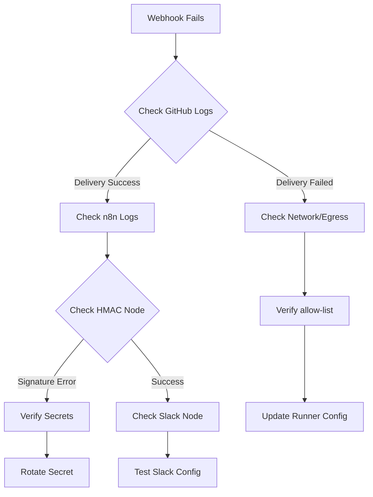

# 🔒 Production Runbook - n8n Webhook Operations

## 🚨 Emergency Procedures

### Secret Rotation (30-second process)

#### 1. Generate New Secret
```bash
openssl rand -base64 32
# Copy the output - this is your new secret
```

#### 2. Update GitHub Environment
- Go to **Repository → Settings → Environments**
- Select environment (staging/production)
- Update `N8N_WEBHOOK_SECRET` with new value
- **Save immediately**

#### 3. Update n8n Environment Variable
- Go to **n8n Settings → Environment Variables**
- Update `N8N_WEBHOOK_SECRET` with same new value
- **Restart the workflow** (deactivate → activate)

#### 4. Smoke Test
- Trigger a deployment or use manual test
- Verify Slack notification arrives
- Check n8n execution logs for success

### Webhook Failure Response

#### Immediate Actions (5 minutes)
1. **Check GitHub Actions logs** for webhook delivery status
2. **Verify n8n workflow is active** and not paused
3. **Test webhook manually** using replay script
4. **Check egress allow-list** includes `pixx100.app.n8n.cloud:443`

#### Debug Commands
```bash
# Test webhook connectivity
curl -I https://pixx100.app.n8n.cloud/webhook-test/cursor-webhook

# Replay last payload (if available)
./replay.sh payload.json

# Generate test signature
echo '{"test": "debug"}' | openssl dgst -sha256 -hmac "YOUR_SECRET" -binary | base64
```

## 🔍 Troubleshooting Guide

### Common Issues & Solutions

#### 1. "Missing X-Signature-256 header"
**Symptoms**: n8n HMAC verification fails
**Root Cause**: GitHub Actions not sending signature header
**Solution**:
- Check GitHub Actions workflow syntax
- Verify `WEBHOOK_SECRET` is set in environment
- Ensure webhook step runs with `if: ${{ always() }}`

#### 2. "Invalid signature"
**Symptoms**: HMAC verification fails in n8n
**Root Cause**: Secret mismatch or payload corruption
**Solution**:
- Verify `N8N_WEBHOOK_SECRET` matches in both places
- Check payload JSON structure hasn't changed
- Use replay script to test with known good payload

#### 3. "Missing N8N_WEBHOOK_SECRET"
**Symptoms**: n8n Function node throws error
**Root Cause**: Environment variable not set
**Solution**:
- Set `N8N_WEBHOOK_SECRET` in n8n environment variables
- Restart the workflow after adding
- Test with manual webhook call

#### 4. Webhook Timeout (429/500)
**Symptoms**: GitHub Actions retries webhook
**Root Cause**: n8n workflow taking too long
**Solution**:
- Optimize n8n workflow performance
- Move heavy operations to background
- Increase timeout in GitHub Actions (max 30s)

#### 5. Slack Notifications Not Working
**Symptoms**: Webhook succeeds but no Slack message
**Root Cause**: Slack configuration issue
**Solution**:
- Check Slack credentials in n8n
- Verify channel name and permissions
- Test Slack node independently

### Debug Workflow



## 🧪 Testing Procedures

### Pre-Deployment Testing
```bash
# 1. Test webhook connectivity
curl -I https://pixx100.app.n8n.cloud/webhook-test/cursor-webhook

# 2. Test with sample payload
cat > test-payload.json <<EOF
{
  "event": "deployment",
  "status": "success",
  "repo": "test/repo",
  "sha": "abc123",
  "ref": "main",
  "run_id": "123456",
  "run_attempt": "1",
  "environment": "staging",
  "app_url": "https://test.com",
  "should_deploy": "true",
  "target_environment": "staging",
  "timestamp": "$(date -u +%FT%TZ)"
}
EOF

# 3. Replay test payload
./replay.sh test-payload.json
```

### Post-Deployment Verification
1. **Check n8n execution history** for successful runs
2. **Verify Slack notifications** contain correct data
3. **Confirm HMAC verification** passed in logs
4. **Test replay** with actual deployment payload

## 📊 Monitoring & Alerting

### Key Metrics to Monitor
- **Webhook delivery success rate** (target: >99%)
- **n8n execution time** (target: <10s)
- **HMAC verification failures** (target: 0)
- **Slack notification delivery** (target: 100%)

### Alert Conditions
- Webhook delivery failures > 5% in 5 minutes
- n8n execution time > 15 seconds
- HMAC verification failures > 0
- Slack notification failures > 0

### Health Check Commands
```bash
# Check webhook endpoint health
curl -f https://pixx100.app.n8n.cloud/webhook-test/cursor-webhook

# Verify secret is working
echo '{"test": "health"}' | openssl dgst -sha256 -hmac "$WEBHOOK_SECRET" -binary | base64

# Test full flow
./replay.sh health-check-payload.json
```

## 🔄 Maintenance Procedures

### Monthly Tasks
- [ ] Rotate webhook secret
- [ ] Review n8n execution logs for anomalies
- [ ] Update dependencies (if any)
- [ ] Test disaster recovery procedures

### Quarterly Tasks
- [ ] Review and update runbook
- [ ] Test secret rotation procedure
- [ ] Verify backup procedures
- [ ] Update monitoring thresholds

## 🆘 Emergency Contacts

### Primary
- **DevOps Lead**: [Contact Info]
- **n8n Admin**: [Contact Info]

### Escalation
- **System Administrator**: [Contact Info]
- **Security Team**: [Contact Info]

---

**Last Updated**: $(date)
**Version**: 1.0
**Next Review**: $(date -d '+3 months')
